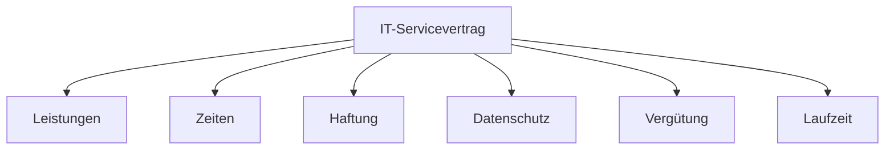

---
# Identity (stable; never change after publishing)
id: ap1-0343
slug: it-servicevertrag-bestandteile

# Display
title: "Bestandteile eines IT-Servicevertrags"

# Classification / navigation (machine-side)
module: "auftragsabwicklung-und-leistungserbringung"
topics: ["it-servicevertrag", "vertrag", "service-management"]
tags: ["wartung", "haftung", "datenschutz", "verguetung"]

# Flashcard payload
card:
  type: multi
  question: "Welche Bestandteile enthält ein IT-Servicevertrag?"
  answer: "Ein IT-Servicevertrag regelt, welche IT-Systeme betreut werden, welche Leistungen der Anbieter erbringt, wann der Service verfügbar ist, welche Pflichten beide Seiten haben, wie Datenschutz und Datensicherheit umgesetzt werden, wer haftet, was der Service kostet und wie lange der Vertrag läuft."
  examples:
    - "Wartungsgegenstand: z. B. Server, Clients, Netzwerk, Software oder Standorte"
    - "Leistungen: Wartung, Support, Updates, Fehlerbehebung oder Monitoring"
    - "Einsatzzeiten: z. B. Montag bis Freitag von 8 bis 17 Uhr"
    - "Ansprechpartner: zuständige Personen beim Kunden und Anbieter"
    - "Mitwirkungspflichten: Kunde stellt Zugang, Informationen oder Termine bereit"
    - "Mängelgewährleistung: Regelung bei fehlerhaften Leistungen"
    - "Datenschutz: Umgang mit personenbezogenen Daten"
    - "Datensicherheit: Schutzmaßnahmen, Zugriffsschutz und Vertraulichkeit"
    - "Haftung: Verantwortung bei Schäden oder Ausfällen"
    - "Vergütung: monatliche Pauschale, Stundenabrechnung oder Festpreis"
    - "Laufzeit und Kündigung: Vertragsdauer und Kündigungsfristen"
    - "Merksatz: IT-Servicevertrag = was wird betreut, wann, durch wen, wie sicher, wie teuer und wie lange?"

# Lifecycle
status: published       # draft | published | deprecated
created: "2026-03-28"
updated: "2026-05-12"
---

## Bestandteile eines IT-Servicevertrags

Ein IT-Servicevertrag regelt die Zusammenarbeit zwischen Anbieter und Kunde für Wartung und Betrieb von IT-Systemen.

## Kernerklärung
IT-Serviceverträge enthalten typischerweise folgende Regelungen:

- **Wartungsgegenstand**
  - Welche Systeme und Standorte betroffen sind

- **Leistungen & Einsatzzeiten**
  - Welche Services erbracht werden
  - Wann diese verfügbar sind (z. B. Mo–Fr 08:00–16:00)

- **Mitwirkung & Ansprechpartner**
  - Pflichten des Kunden
  - Erreichbarkeit von Kontaktpersonen

- **Mängelgewährleistung**
  - Regelung bei Fehlern und Störungen

- **Datenschutz & Datensicherheit**
  - Umgang mit sensiblen Daten

- **Haftung**
  - Verantwortlichkeit bei Schäden (z. B. Datenverlust)

- **Vergütung**
  - Bezahlung der Leistungen

- **Laufzeit & Kündigung**
  - Vertragsdauer und Beendigung

- **Nebenabreden / salvatorische Klausel**
  - Zusatzvereinbarungen und rechtliche Absicherung

### Struktur eines IT-Servicevertrags

## Praktisches Beispiel
Ein Unternehmen beauftragt einen IT-Dienstleister:

- Wartung von Servern und Netzwerken
- Supportzeiten: Mo–Fr 08:00–16:00
- Reaktion bei Störungen innerhalb von 4 Stunden
- Monatliche Pauschale als Vergütung

## Prüfungsrelevanz (AP1)
Typisches Thema im Bereich **IT-Service & Vertragsgestaltung**.

### Typische Prüfungsfragen
- Welche Inhalte gehören in einen IT-Servicevertrag?
- Warum sind Einsatzzeiten wichtig?
- Welche Rolle spielt Datenschutz im Vertrag?

### Antworten auf die typischen Prüfungsfragen
- Vertrag enthält Leistungen, Zeiten, Haftung, Datenschutz, Vergütung usw.
- Einsatzzeiten definieren die Verfügbarkeit des Supports
- Datenschutz regelt den sicheren Umgang mit Kundendaten

## Merksatz
**IT-Servicevertrag = Leistung + Zeit + Verantwortung + Sicherheit + Bezahlung**