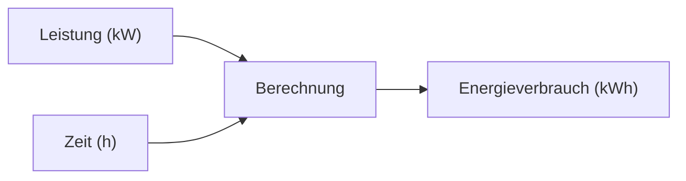

---
# Identity (stable; never change after publishing)
id: ap1-0216
slug: energieverbrauch-it-berechnung

# Display
title: "Energieverbrauch einer IT-Landschaft berechnen"

# Classification / navigation (machine-side)
module: "Beurteilen marktgängiger IT-Systeme und Lösungen"
topics: ["energie", "berechnung"]
tags: ["leistung", "kwh", "verbrauch"]

# Flashcard payload
card:
  type: basic
  question: "Berechne den Jahresstromverbrauch einer IT-Landschaft im 24/7-Betrieb: 10 Server mit je 800 W, 25 PCs mit je 350 W und 2 Switches mit je 200 W."
  answer: |
    1. Gesamtleistung berechnen:
    10 Server × 800 W = 8.000 W = 8 kW
    25 PCs × 350 W = 8.750 W = 8,75 kW
    2 Switches × 200 W = 400 W = 0,4 kW

    Gesamtleistung:
    8 kW + 8,75 kW + 0,4 kW = 17,15 kW

    2. Jahresstunden bei 24/7-Betrieb:
    24 h × 365 Tage = 8.760 h

    3. Jahresverbrauch berechnen:
    17,15 kW × 8.760 h = 150.234 kWh

    Ergebnis: Die IT-Landschaft verbraucht pro Jahr 150.234 kWh.
  examples:
    - "Watt zuerst in Kilowatt umrechnen: 1.000 W = 1 kW"
    - "24/7-Betrieb pro Jahr: 24 × 365 = 8.760 Stunden"
    - "Formel: Energieverbrauch = Leistung in kW × Zeit in Stunden"
    - "Merksatz: kW × h = kWh"

# Lifecycle
status: published
created: "2026-03-17"
updated: "2026-05-11"
---

## Energieverbrauch einer IT-Landschaft berechnen

Zur Berechnung des Energieverbrauchs einer IT-Landschaft:

- Leistung aller Geräte addieren  
- in **Kilowatt (kW)** umrechnen  
- mit Betriebszeit multiplizieren  

---

## Kernerklärung

### Gegebene Werte

| Gerät | Anzahl | Leistung pro Gerät | Gesamtleistung |
|---|---|---|---|
| Server | 10 | 800 W | 8.000 W = 8 kW |
| Desktop-PCs | 25 | 350 W | 8.750 W = 8,75 kW |
| Switches | 2 | 200 W | 400 W = 0,4 kW |

---

### Gesamtleistung

- **8 kW + 8,75 kW + 0,4 kW = 17,15 kW**

---

### Jahresverbrauch (24/7)

- 24 Stunden × 365 Tage = **8.760 Stunden**

- **17,15 kW × 8.760 h = 150.234 kWh**

---

### Formel

**Energie (kWh) = Leistung (kW) × Zeit (h)**

---

## Praktisches Beispiel

- Rechenzentrum mit Dauerbetrieb:
  - konstante Last → hohe Energiekosten  
- Grundlage für:
  - Kostenplanung  
  - Kühlungsdimensionierung  

---

## Prüfungsrelevanz (AP1)

Wichtig:

- Umrechnung **Watt → Kilowatt**  
- Formel:  
  - **Energie = Leistung × Zeit**  
- 24/7 = **8.760 Stunden/Jahr**  

---

### Typische Prüfungsfragen

- Wie berechnet man den Energieverbrauch?
- Wie viele Stunden hat ein Jahr im Dauerbetrieb?
- Warum wird in kWh gerechnet?

---

### Antworten auf die typischen Prüfungsfragen

**Formel?**  
→ Energie = Leistung × Zeit  

**Stunden/Jahr?**  
→ 8.760 Stunden  

**Warum kWh?**  
→ Standard-Einheit für Energieverbrauch  

---

## Merksatz

**Energie (kWh) = Leistung (kW) × Zeit (h).**