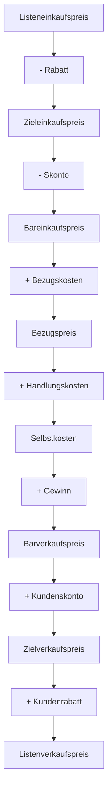

---
# Identity (stable; never change after publishing)
id: ap1-0236
slug: handelskalkulation-bestandteile

# Display
title: "Handelskalkulation: Bestandteile und Abgrenzung zur Zuschlagskalkulation"

# Classification / navigation (machine-side)
module: "Beurteilen marktgängiger IT-Systeme und Lösungen"
topics: ["Kalkulation", "Kostenrechnung", "BWL"]
tags: ["ap1", "handelskalkulation", "zuschlagskalkulation"]

# Flashcard payload
card:
  type: comparison
  question: "Wie ist eine Handelskalkulation aufgebaut und wie unterscheidet sie sich von der Zuschlagskalkulation?"
  answer: "Die Handelskalkulation wird vor allem im Warenhandel genutzt. Sie führt vom Listeneinkaufspreis über Rabatte, Skonto, Bezugskosten, Handlungskosten und Gewinn zum Listenverkaufspreis. Die Zuschlagskalkulation wird eher in der Fertigung genutzt und berechnet Selbstkosten aus Einzelkosten und Gemeinkosten, z. B. Materialkosten, Lohnkosten und Gemeinkostenzuschläge."
  examples:
    - "Handelskalkulation: Listeneinkaufspreis → Zieleinkaufspreis → Bareinkaufspreis → Bezugspreis → Selbstkosten → Barverkaufspreis → Zielverkaufspreis → Listenverkaufspreis"
    - "Handelskalkulation: typisch für Einkauf und Verkauf von Waren"
    - "Zuschlagskalkulation: typisch für Produktion oder Dienstleistungen"
    - "Zuschlagskalkulation: Materialeinzelkosten + Materialgemeinkosten + Fertigungskosten + Verwaltung + Vertrieb"
    - "Merksatz: Handel kalkuliert vom Einkauf zum Verkauf, Zuschlagskalkulation rechnet Kosten über Zuschläge zusammen"

# Lifecycle
status: published       # draft | published | deprecated
created: "2026-03-18"
updated: "2026-05-11"
---

## Handelskalkulation: Bestandteile und Abgrenzung zur Zuschlagskalkulation
Die **Handelskalkulation** dient zur Ermittlung von Einkaufs- und Verkaufspreisen im Handel.

➡️ Unterschied:
- **Handel** → arbeitet mit Ein- und Verkaufspreisen  
- **Produktion (Zuschlagskalkulation)** → arbeitet mit Herstellkosten  

## Kernerklärung

### Ablauf der Handelskalkulation

### Bestandteile im Überblick

| Bereich | Bestandteile |
|--------|-------------|
| **Einkauf** | Listeneinkaufspreis, Rabatt, Skonto |
| **Beschaffung** | Bezugskosten |
| **Kosten** | Handlungskosten → Selbstkosten |
| **Verkauf** | Gewinn, Kundenskonto, Kundenrabatt |

---

### Zuschlagskalkulation (Vorkalkulation)

➡️ Wird in der **Produktion** verwendet:

| Kostenart | Beispiele |
|----------|----------|
| Materialkosten | Materialeinzelkosten + Gemeinkosten |
| Lohnkosten | Fertigungslöhne + Gemeinkosten |
| Herstellkosten | Summe aus Material + Lohn |
| Selbstkosten | + Verwaltungs- und Vertriebskosten |

## Praktisches Beispiel

Ein Händler kauft Ware:

- Listeneinkaufspreis: 1.000 €  
- Rabatt: 10 % → 900 €  
- + Bezugskosten: 50 € → Bezugspreis 950 €  
- + Gewinn: → Verkaufspreis entsteht  

➡️ Ziel: profitabler Verkaufspreis

## Prüfungsrelevanz (AP1)

### Typische Prüfungsfragen
- Reihenfolge der Handelskalkulation?
- Unterschied Handels- vs. Zuschlagskalkulation?
- Was sind Bezugskosten?

### Antworten auf die typischen Prüfungsfragen
- Einkauf → Kosten → Verkauf  
- Handel = Preise, Produktion = Kostenstruktur  
- Transport, Verpackung etc.

## Merksatz
**Handelskalkulation = vom Einkauf zum Verkaufspreis, Zuschlagskalkulation = von Kosten zum Preis.**