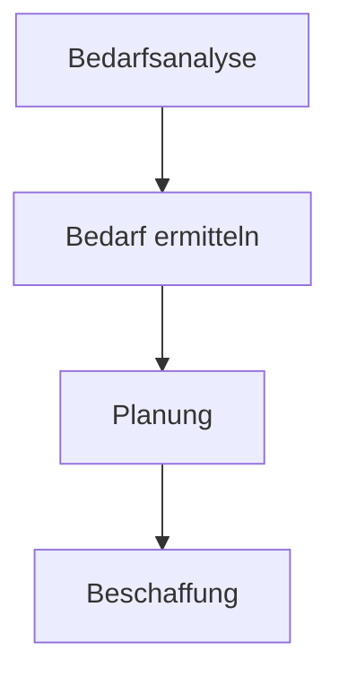

---
# Identity (stable; never change after publishing)
id: ap1-0237
slug: bedarfsanalyse-definition

# Display
title: "Bedarfsanalyse – Definition und Zweck"

# Classification / navigation (machine-side)
module: "Entwickeln, Erstellen und Betreuen von IT_Lösungen"
topics: ["Analyse", "Planung", "Beschaffung"]
tags: ["ap1", "bedarfsanalyse", "projekt"]

# Flashcard payload
card:
  type: basic
  question: "Wie definiert man den Begriff Bedarfsanalyse?"
  answer: "Eine Bedarfsanalyse ist die systematische Ermittlung, was in einem bestimmten Zeitraum benötigt wird. Dabei werden z. B. Waren, Dienstleistungen, IT-Systeme, Lizenzen, Personal oder andere Ressourcen erfasst, um Beschaffung und Projekte sinnvoll planen zu können."
  examples:
    - "Ermittlung benötigter Serverkapazitäten"
    - "Planung benötigter Softwarelizenzen"
    - "Feststellen, wie viele Arbeitsplätze ausgestattet werden müssen"
    - "Prüfen, welche Hardware für ein Projekt benötigt wird"
    - "Merksatz: Bedarfsanalyse = systematisch feststellen, was gebraucht wird"

# Lifecycle
status: published       # draft | published | deprecated
created: "2026-03-18"
updated: "2026-05-11"
---

## Bedarfsanalyse – Definition und Zweck
Die **Bedarfsanalyse** ist ein zentraler Schritt in der Planung von IT-Projekten und Beschaffungen.

 Ziel:
- Klarheit darüber, **was, wann und wie viel benötigt wird**

## Kernerklärung

- Analyse des Bedarfs an:
  - **Waren**
  - **Dienstleistungen**
  - **Personal**
- Betrachtung nach:
  - **Region**
  - **Zielgruppe**
  - **Zeitraum**
- Ergebnis:
  - Grundlage für **Beschaffung und Planung**

 Zweck:
- bessere Planung von Projekten  
- Vermeidung von Über- oder Unterbeschaffung  

## Praktisches Beispiel

Ein Unternehmen plant ein neues IT-System:

- Analyse: Wie viele Benutzer?  
- Bedarf: Anzahl Server, Lizenzen, Speicher  
- Ergebnis: konkrete Einkaufsplanung  

## Prüfungsrelevanz (AP1)

### Typische Prüfungsfragen
- Was ist eine Bedarfsanalyse?
- Warum ist sie wichtig?
- Welche Faktoren werden berücksichtigt?

### Antworten auf die typischen Prüfungsfragen
- Ermittlung des Bedarfs an Ressourcen  
- Grundlage für Planung und Beschaffung  
- Zeitraum, Zielgruppe, Art der Ressourcen  

## Merksatz
**Erst Bedarf klären, dann beschaffen.**