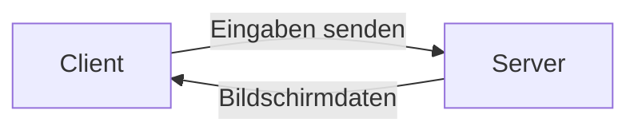

---
# Identity (stable; never change after publishing)
id: ap1-0240
slug: remote-desktop-verbindung-rdp

# Display
title: "Remote Desktop Verbindung (RDP) – Funktionsweise"

# Classification / navigation (machine-side)
module: "Entwickeln, Erstellen und Betreuen von IT_Lösungen"
topics: ["Netzwerk", "Remotezugriff", "Protokolle"]
tags: ["ap1", "rdp", "remote-desktop"]

# Flashcard payload
card:
  type: basic
  question: "Wie funktioniert eine Remote-Desktop-Verbindung?"
  answer: "Eine Remote-Desktop-Verbindung ermöglicht den Fernzugriff auf einen Computer über ein Netzwerk. Dabei wird die grafische Oberfläche des entfernten Computers übertragen, während Tastatur- und Mauseingaben vom lokalen Gerät an den entfernten Computer gesendet werden. Bei Microsoft RDP wird standardmäßig Port 3389 verwendet."
  examples:
    - "Fernwartung eines PCs"
    - "Zugriff auf einen Firmenserver von zu Hause"
    - "Administrator verbindet sich mit einem entfernten Windows-Server"
    - "Lokale Ressourcen wie Zwischenablage, Drucker oder Laufwerke können je nach Einstellung eingebunden werden"
    - "RDP verwendet standardmäßig TCP/UDP-Port 3389"

# Lifecycle
status: published       # draft | published | deprecated
created: "2026-03-18"
updated: "2026-05-11"
---

## Remote Desktop Verbindung (RDP) – Funktionsweise
Eine Remote Desktop Verbindung ermöglicht es, einen entfernten Computer so zu bedienen, als säße man direkt davor.

- Häufig genutzt im IT-Support und bei virtuellen Desktops  
- Standardprotokoll: RDP (Remote Desktop Protocol)  

## Kernerklärung

- Verbindung über Netzwerkprotokoll **RDP (Microsoft)**
- Kommunikation über **TCP/UDP Port 3389**
- Übertragen wird:
  - Bildschirminhalt des entfernten Systems
- Lokale Eingaben werden gesendet:
  - Maus
  - Tastatur
- Zusätzlich nutzbar:
  - Audio
  - Laufwerke
  - Drucker
  - Zwischenablage

### Funktionsprinzip

1. Client baut Verbindung zum Server auf  
2. Server sendet Bildschirminhalte  
3. Client sendet Eingaben zurück  
4. Ressourcen werden optional weitergeleitet  

## Praktisches Beispiel

Ein IT-Administrator greift auf einen Firmen-PC zu:

- Verbindung über RDP  
- Sieht den Desktop des entfernten Rechners  
- Führt Wartungsarbeiten durch  

## Prüfungsrelevanz (AP1)

### Typische Prüfungsfragen
- Was ist RDP?
- Über welchen Port läuft RDP?
- Welche Daten werden übertragen?

### Antworten auf die typischen Prüfungsfragen
- Protokoll für Fernzugriff auf Computer  
- Port 3389 (TCP/UDP)  
- Bildschirmdaten + Eingaben + Ressourcen  

## Merksatz
RDP überträgt Bildschirm und Eingaben, sodass ein entfernter PC wie lokal bedient werden kann.