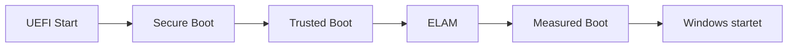

---
# Identity (stable; never change after publishing)
id: ap1-0243
slug: windows-boot-sicherheitsfeatures

# Display
title: "Sicherheitsfeatures beim Windows-Start"

# Classification / navigation (machine-side)
module: "Entwickeln, Erstellen und Betreuen von IT_Lösungen"
topics: ["Sicherheit", "Bootprozess", "UEFI"]
tags: ["ap1", "windows", "boot", "security"]

# Flashcard payload
card:
  type: basic
  question: "Welche 4 Features schützen den Windows-10-Startvorgang vor Schadsoftware wie Rootkits und Bootkits?"
  answer: "Den Windows-10-Startvorgang schützen: Secure Boot, Trusted Boot, Early Launch Anti-Malware (ELAM) und Measured Boot. Secure Boot prüft den Bootloader, Trusted Boot prüft Windows-Startkomponenten, ELAM lädt Antischadsoftware früh im Startprozess und Measured Boot protokolliert den Startzustand für Vertrauensprüfung."
  examples:
    - "Secure Boot → verhindert unsignierte oder manipulierte Bootloader"
    - "Trusted Boot → prüft Windows-Startkomponenten"
    - "ELAM → startet Antischadsoftware früh vor anderen Treibern"
    - "Measured Boot → misst/protokolliert Startkomponenten für spätere Prüfung"
    - "Merksatz: Secure, Trusted, ELAM, Measured"

# Lifecycle
status: published       # draft | published | deprecated
created: "2026-03-18"
updated: "2026-05-11"
---

## Sicherheitsfeatures beim Windows-Start
Windows nutzt mehrere Sicherheitsmechanismen im Bootprozess, um Schadsoftware bereits vor dem Systemstart zu verhindern.

Diese schützen insbesondere vor Rootkits und Bootkits.

## Kernerklärung

### Die 4 Sicherheitsfeatures

1. **Sicherer Start (Secure Boot)**
   - nur vertrauenswürdige Bootloader werden geladen
   - basiert auf UEFI und TPM

2. **Vertrauenswürdiger Start (Trusted Boot)**
   - überprüft Integrität aller Komponenten beim Start
   - verhindert Manipulationen im Bootprozess

3. **Antischadsoftware-Frühstart (ELAM)**
   - prüft Treiber vor dem Laden
   - blockiert nicht signierte oder verdächtige Treiber

4. **Kontrollierter Start (Measured Boot)**
   - protokolliert Startvorgang
   - ermöglicht Integritätsprüfung durch externe Systeme

## Praktisches Beispiel

- Ein manipuliertes Bootkit wird erkannt:
  - Secure Boot verhindert das Laden
- Ein unsignierter Treiber:
  - wird durch ELAM blockiert

## Prüfungsrelevanz (AP1)

### Typische Prüfungsfragen
- Welche Schutzmechanismen gibt es beim Windows-Start?
- Was macht Secure Boot?
- Wofür steht ELAM?

### Antworten auf die typischen Prüfungsfragen
- Secure Boot, Trusted Boot, ELAM, Measured Boot  
- Verhindert unsignierte Bootloader  
- Early Launch Anti Malware  

## Merksatz
Vier Schutzstufen sichern den Windows-Start: Secure Boot, Trusted Boot, ELAM und Measured Boot.