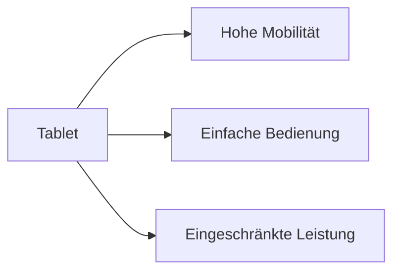

---
# Identity (stable; never change after publishing)
id: ap1-0251
slug: tablet-vor-und-nachteile

# Display
title: "Tablet – Vor- und Nachteile"

# Classification / navigation (machine-side)
module: "Entwickeln, Erstellen und Betreuen von IT_Lösungen"
topics: ["Hardware", "Endgeräte", "Mobile Geräte"]
tags: ["ap1", "tablet", "hardware"]

# Flashcard payload
card:
  type: comparison
  question: "Was sind Vor- und Nachteile von Tablets?"
  answer: "Vorteile von Tablets sind geringes Gewicht, hohe Mobilität, lange Akkulaufzeit, einfache Touchbedienung und schneller Einsatz unterwegs. Nachteile sind eingeschränkte Eingabemöglichkeiten, geringere Leistung und Speicherkapazität im Vergleich zu vielen Notebooks, wenige Anschlüsse und meist kaum Aufrüstbarkeit."
  examples:
    - "Tablet für Präsentationen oder Kundentermine"
    - "Mobiles Arbeiten mit Touchbedienung"
    - "Vorteil: leicht zu transportieren"
    - "Nachteil: längere Texte oder komplexe Arbeiten sind ohne Tastatur schwieriger"
    - "Nachteil: Anschlüsse und Erweiterungsmöglichkeiten sind oft begrenzt"
    - "Merksatz: Tablet = mobil und einfach, aber weniger flexibel als ein Notebook"

# Lifecycle
status: published       # draft | published | deprecated
created: "2026-03-18"
updated: "2026-05-11"
---

## Tablet – Vor- und Nachteile
Tablets sind mobile Endgeräte mit Fokus auf einfache Bedienung und hohe Mobilität.

Sie werden hauptsächlich per Touchscreen gesteuert.

## Kernerklärung

### Vorteile
- leichte Handhabung  
- lange Akkulaufzeit  
- Touchbedienung (optional mit Stift)  
- WLAN oder WWAN Verbindung möglich  
- platzsparend  
- geringes Gewicht  

### Nachteile
- Schreiben auf virtueller Tastatur auf Dauer anstrengend  
- geringere Speicher- und Leistungsfähigkeit als Notebooks  
- wenige Anschluss- und Erweiterungsmöglichkeiten  
- meist nicht oder nur schwer aufrüstbar  

| Kriterium        | Tablet Vorteil                 | Tablet Nachteil                  |
|------------------|------------------------------|----------------------------------|
| Mobilität        | sehr hoch                     | eingeschränkte Produktivität     |
| Bedienung        | einfach (Touch)               | Tippen langsamer                 |
| Hardware         | leicht, kompakt               | weniger Leistung                 |
| Erweiterbarkeit  | -                             | kaum möglich                     |

## Praktisches Beispiel

- Außendienst:
  - Präsentationen direkt beim Kunden  
  - Dateneingabe per Touch oder Stift  

- Freizeit:
  - Surfen, Streaming, Apps  

## Prüfungsrelevanz (AP1)

### Typische Prüfungsfragen
- Nenne Vorteile von Tablets
- Nenne Nachteile von Tablets
- Wann sind Tablets sinnvoll?

### Antworten auf die typischen Prüfungsfragen
- Vorteile: mobil, leicht, lange Akkulaufzeit  
- Nachteile: eingeschränkte Leistung, Eingabe schwierig  
- sinnvoll für mobile Nutzung und einfache Anwendungen  

## Merksatz
Tablets sind leicht und mobil, aber weniger leistungsfähig und eingeschränkt erweiterbar.