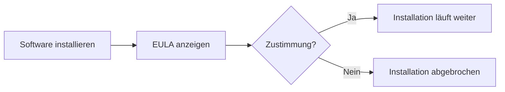

---
# Identity (stable; never change after publishing)
id: ap1-0265
slug: eula-definition

# Display
title: "EULA – Endbenutzer-Lizenzvereinbarung"

# Classification / navigation (machine-side)
module: "Entwickeln, Erstellen und Betreuen von IT_Lösungen"
topics: ["Software", "Lizenzierung"]
tags: ["ap1", "eula", "lizenz", "software"]

# Flashcard payload
card:
  type: definition
  question: "Was ist eine EULA?"
  answer: "Eine EULA ist ein Endbenutzer-Lizenzvertrag. Sie enthält die Nutzungsbedingungen einer Software, z. B. was der Nutzer darf, was verboten ist und welche Rechte der Hersteller behält. Meist muss man der EULA vor der Installation oder Nutzung zustimmen."
  examples:
    - "Zustimmung vor der Installation einer Software"
    - "Lizenzbedingungen bei einer Windows-Installation"
    - "Regeln zur Nutzung, Weitergabe oder Veränderung der Software"
    - "Merksatz: EULA = Nutzungsvertrag zwischen Hersteller und Endnutzer"

# Lifecycle
status: published       # draft | published | deprecated
created: "2026-03-18"
updated: "2026-05-11"
---

## EULA – Endbenutzer-Lizenzvereinbarung
Die EULA (End User License Agreement) ist ein zentraler Bestandteil bei der Installation von Software und regelt die **rechtlichen Nutzungsbedingungen**.

## Kernerklärung

- EULA = **Endbenutzer-Lizenzvereinbarung**
- definiert:
  - Nutzungsrechte  
  - Einschränkungen  
  - Weitergabe / Vervielfältigung  

- wichtig:
  - erscheint meist **zu Beginn der Installation**
  - Installation kann nur fortgesetzt werden, wenn:
    - der Nutzer zustimmt  

## Praktisches Beispiel

- Installation von:
  - Windows  
  - Office  
  - Anwendungen wie Browser  

- typischer Ablauf:
  - Lizenztext wird angezeigt  
  - Checkbox „Ich stimme zu“  
  - ohne Zustimmung → keine Installation  

## Prüfungsrelevanz (AP1)

### Typische Prüfungsfragen
- Was ist eine EULA?  
- Wann wird sie angezeigt?  
- Was passiert ohne Zustimmung?  

### Antworten auf die typischen Prüfungsfragen
- Lizenzvereinbarung für Software  
- Zu Beginn der Installation  
- Installation wird abgebrochen  

## Merksatz
Ohne Zustimmung zur EULA keine Nutzung der Software.