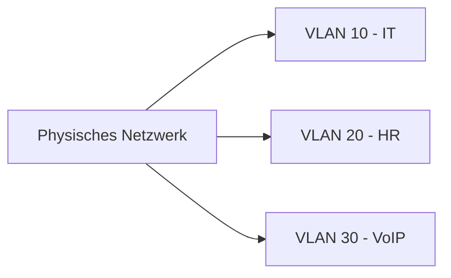

---
# Identity (stable; never change after publishing)
id: ap1-0272
slug: vlan-vorteile

# Display
title: "VLAN – Vorteile"

# Classification / navigation (machine-side)
module: "Entwickeln, Erstellen und Betreuen von IT_Lösungen"
topics: ["Netzwerk", "VLAN", "Strukturierung"]
tags: ["ap1", "vlan", "netzwerk", "segmentierung"]

# Flashcard payload
card:
  type: multi
  question: "Welche Vorteile bietet ein VLAN?"
  answer: "Ein VLAN ermöglicht die logische Trennung eines Netzwerks, ohne dafür getrennte physische Switches zu benötigen. Dadurch können Abteilungen, Gerätearten oder Sicherheitsbereiche getrennt werden. VLANs verbessern die Übersicht, erhöhen die Sicherheit, verkleinern Broadcast-Domänen und ermöglichen eine flexible Netzwerkstruktur."
  examples:
    - "Trennung von Abteilungen: z. B. HR, IT und Buchhaltung"
    - "Trennung von Gerätearten: z. B. PCs, Drucker, Server und VoIP-Telefone"
    - "Sicherheit: Gäste-WLAN getrennt vom internen Firmennetz"
    - "Weniger Broadcast-Verkehr innerhalb einzelner VLANs"
    - "Flexibilität: Geräte können logisch gruppiert werden, auch wenn sie an verschiedenen Switches hängen"
    - "VoIP: Sprachdaten können über ein eigenes VLAN getrennt werden"
    - "Merksatz: VLAN = ein physisches Netzwerk, mehrere logisch getrennte Netze"

# Lifecycle
status: published       # draft | published | deprecated
created: "2026-03-18"
updated: "2026-05-11"
---

## VLAN – Vorteile
Ein **VLAN (Virtual Local Area Network)** ermöglicht die **logische Segmentierung eines physischen Netzwerks**.

## Kernerklärung

Vorteile von VLANs:

- Aufteilung eines physischen Netzwerks in **logische Gruppen**
- **Priorisierung** von Datenverkehr möglich (z. B. VoIP)
- **Bessere Lastverteilung**
- **Reduzierung von Broadcast-Domänen** → weniger Kollisionen
- **Flexible Zuordnung** von Geräten zu Gruppen
- **Trennung von Datenverkehr** nach Anwendungen oder Abteilungen

## Praktisches Beispiel

- Unternehmen:
  - VLAN 10 → IT-Abteilung  
  - VLAN 20 → Personalabteilung  
  - VLAN 30 → VoIP-Telefonie  

→ Datenverkehr ist getrennt und sicherer

## Prüfungsrelevanz (AP1)

### Typische Prüfungsfragen
- Warum werden VLANs eingesetzt?  
- Was ist eine Broadcast-Domäne?  
- Welche Vorteile bieten VLANs?  

### Antworten auf die typischen Prüfungsfragen
- Zur Segmentierung und besseren Kontrolle des Netzwerks  
- Bereich, in dem Broadcasts verteilt werden  
- Sicherheit, Performance, Flexibilität  

## Merksatz
VLANs trennen Netzwerke logisch – für mehr Sicherheit, Übersicht und Leistung.