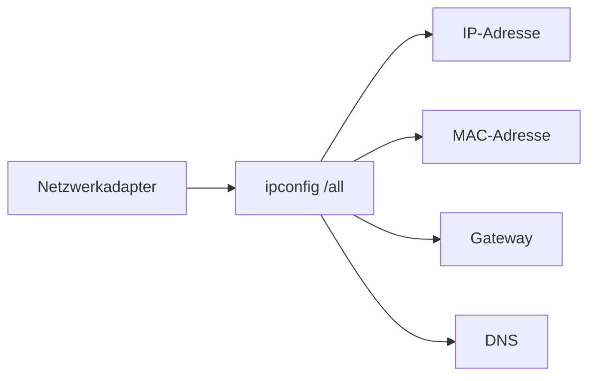

---
# Identity (stable; never change after publishing)
id: ap1-0276
slug: ipconfig-all-netzwerkinfo

# Display
title: "ipconfig /all – Netzwerkinformationen anzeigen"

# Classification / navigation (machine-side)
module: "Entwickeln, Erstellen und Betreuen von IT_Lösungen"
topics: ["Netzwerk", "Diagnose", "IP-Konfiguration"]
tags: ["ap1", "ipconfig", "netzwerk", "ip"]

# Flashcard payload
card:
  type: definition
  question: "Mit welchem Kommando zeigt man detaillierte Netzwerkinformationen an?"
  answer: "Unter Windows zeigt ipconfig /all detaillierte Netzwerkinformationen an. Dazu gehören IP-Adresse, Subnetzmaske, Standardgateway, DNS-Server, DHCP-Informationen und die MAC-Adresse als Physische Adresse."
  examples:
    - "ipconfig: zeigt grundlegende IP-Informationen"
    - "ipconfig /all: zeigt ausführliche Netzwerkinformationen"
    - "IP-Adresse: Adresse des Geräts im Netzwerk"
    - "Standardgateway: Router für Verbindungen in andere Netzwerke"
    - "DNS-Server: löst Domainnamen in IP-Adressen auf"
    - "Physische Adresse: MAC-Adresse des Netzwerkadapters"
    - "Merksatz: ipconfig /all = alle wichtigen Netzwerkinfos anzeigen"

# Lifecycle
status: published       # draft | published | deprecated
created: "2026-03-18"
updated: "2026-05-11"
---

## ipconfig /all – Netzwerkinformationen anzeigen
Der Befehl **ipconfig /all** zeigt **detaillierte Informationen zu allen Netzwerkadaptern** eines Systems.

## Kernerklärung

Mit `ipconfig /all` erhält man:

- **IP-Adresse (IPv4 / IPv6)**
- **MAC-Adresse (physische Adresse)**
- **Subnetzmaske**
- **Standardgateway**
- **DNS-Server**
- **DHCP-Status (aktiv/inaktiv)**

→ Deutlich ausführlicher als `ipconfig`



## Praktisches Beispiel

```bash
ipconfig /all
```

Typische Ausgabe:
- Ethernet-Adapter:
  - IPv4: 192.168.x.x  
  - Gateway: 192.168.x.1  
  - DNS: 192.168.x.1  

## Prüfungsrelevanz (AP1)

### Typische Prüfungsfragen
- Was zeigt ipconfig /all?  
- Unterschied ipconfig vs. ipconfig /all?  
- Welche Informationen sind wichtig?  

### Antworten auf die typischen Prüfungsfragen
- Detaillierte Netzwerkinformationen  
- `/all` zeigt zusätzliche Details  
- IP, MAC, DNS, Gateway, DHCP  

## Merksatz
ipconfig /all zeigt alles über dein Netzwerk – von IP bis DNS.