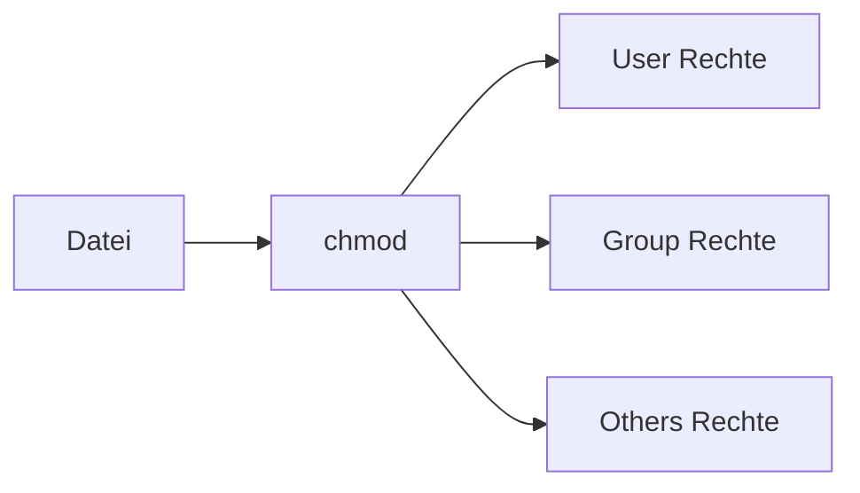

---
# Identity (stable; never change after publishing)
id: ap1-0278
slug: chmod-linux-dateiberechtigungen

# Display
title: "chmod – Dateiberechtigungen in Linux"

# Classification / navigation (machine-side)
module: "Entwickeln, Erstellen und Betreuen von IT_Lösungen"
topics: ["Linux", "Dateisystem", "Berechtigungen"]
tags: ["ap1", "chmod", "linux", "rechte"]

# Flashcard payload
card:
  type: definition
  question: "Was macht der Linux-Befehl chmod?"
  answer: "chmod ändert die Berechtigungen von Dateien und Verzeichnissen. Dabei geht es um Lesen, Schreiben und Ausführen für Benutzer, Gruppe und andere. Die Rechte können symbolisch, z. B. u+x, oder numerisch/oktal, z. B. 770, gesetzt werden."
  examples:
    - "r = read = lesen"
    - "w = write = schreiben"
    - "x = execute = ausführen"
    - "u = user = Besitzer"
    - "g = group = Gruppe"
    - "o = others = andere Benutzer"
    - "chmod u+x script.sh: Besitzer darf Script ausführen"
    - "chmod 770 test.txt: Benutzer und Gruppe haben volle Rechte, andere keine"
    - "Merksatz: chmod = Rechte ändern"

# Lifecycle
status: published       # draft | published | deprecated
created: "2026-03-18"
updated: "2026-05-11"
---

## chmod – Dateiberechtigungen in Linux
Der Befehl **chmod** (change mode) wird verwendet, um die **Zugriffsrechte von Dateien und Verzeichnissen** in Linux/Unix-Systemen zu ändern.

## Kernerklärung

### Grundprinzip
- Rechte werden für drei Gruppen vergeben:
  - **User (u)** – Besitzer  
  - **Group (g)** – Gruppe  
  - **Others (o)** – alle anderen  

- Rechtearten:
  - **r (read)** – lesen  
  - **w (write)** – schreiben  
  - **x (execute)** – ausführen  

### Darstellungsformen

| Schreibweise | Bedeutung |
|-------------|----------|
| Symbolisch  | z. B. `u+r`, `g-w`, `o+x` |
| Oktal       | z. B. `7 7 0` |

### Oktale Werte

| Wert | Bedeutung        | Binär |
|------|-----------------|------|
| 7    | rwx (voll)      | 111  |
| 6    | rw-             | 110  |
| 5    | r-x             | 101  |
| 4    | r--             | 100  |
| 3    | -wx             | 011  |
| 2    | -w-             | 010  |
| 1    | --x             | 001  |
| 0    | ---             | 000  |



## Praktisches Beispiel

```bash
chmod 770 test.txt
```

Bedeutung:
- User: rwx  
- Group: rwx  
- Others: ---  

Symbolisch:
```bash
chmod u+rwx,g+rwx,o-rwx test.txt
```

## Prüfungsrelevanz (AP1)

### Typische Prüfungsfragen
- Was macht chmod?  
- Was bedeuten r, w, x?  
- Unterschied symbolisch vs. oktal?  

### Antworten auf die typischen Prüfungsfragen
- Ändert Dateiberechtigungen  
- Lesen, Schreiben, Ausführen  
- Zwei Darstellungsarten für Rechte  

## Merksatz
chmod steuert, wer was mit einer Datei machen darf.