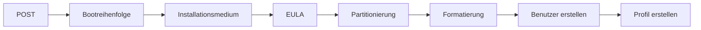

---
# Identity (stable; never change after publishing)
id: ap1-0280
slug: windows-installation-reihenfolge

# Display
title: "Windows-Installation – Reihenfolge der Schritte"

# Classification / navigation (machine-side)
module: "Entwickeln, Erstellen und Betreuen von IT_Lösungen"
topics: ["Betriebssysteme", "Installation", "Prozess"]
tags: ["ap1", "windows", "installation", "ablauf"]

# Flashcard payload
card:
  type: steps
  question: "In welcher Reihenfolge läuft eine typische Windows-Installation ab?"
  answer: "Typische Reihenfolge: 1. POST/Hardwareprüfung beim Start → 2. Bootreihenfolge prüfen oder festlegen → 3. Vom Installationsmedium starten → 4. Windows-Setup starten → 5. EULA/Lizenzbedingungen akzeptieren → 6. Zielpartition auswählen oder erstellen → 7. Partition formatieren → 8. Windows-Dateien kopieren und installieren → 9. Benutzerkonto und Passwort einrichten → 10. Benutzerprofil wird erstellt."
  examples:
    - "POST: Rechner prüft beim Start die Hardware"
    - "Bootreihenfolge: USB-Stick oder DVD als Startmedium wählen"
    - "Installationsmedium: Windows-USB-Stick oder DVD"
    - "EULA: Lizenzbedingungen akzeptieren"
    - "Partition: Speicherbereich für Windows auswählen oder erstellen"
    - "Formatierung: Dateisystem vorbereiten, z. B. NTFS"
    - "Benutzerkonto: Name und Passwort einrichten"
    - "Merksatz: Prüfen, booten, installieren, Benutzer einrichten"

# Lifecycle
status: published       # draft | published | deprecated
created: "2026-03-18"
updated: "2026-05-11"
---

## Windows-Installation – Reihenfolge der Schritte
Die Installation eines Windows-Betriebssystems erfolgt in einer **festen logischen Reihenfolge**, beginnend mit dem Systemstart bis zur ersten Benutzeranmeldung.

## Kernerklärung

### Reihenfolge der Installation

1. **POST (Power-On Self Test)**
2. **Bootreihenfolge festlegen**
3. **Installationsmedium einlegen**
4. **EULA lesen und akzeptieren**
5. **Zielpartition auswählen oder erstellen**
6. **Partition formatieren**
7. **Windows-Dateien kopieren und installieren**
8. **Benutzerkonto und Passwort einrichten**
9. **Benutzerprofil für das erste Login erstellen**

## Praktisches Beispiel

- Neuinstallation von Windows:
  - BIOS/UEFI startet (POST)  
  - Boot von USB-Stick  
  - Installationsassistent führt durch:
    - Lizenz akzeptieren  
    - Partition auswählen  
    - Formatieren  
    - Benutzer anlegen  

## Prüfungsrelevanz (AP1)

### Typische Prüfungsfragen
- Welche Schritte gehören zur OS-Installation?  
- Was passiert zuerst (POST)?  
- Wann wird die EULA akzeptiert?  

### Antworten auf die typischen Prüfungsfragen
- Feste Reihenfolge von Boot bis Benutzer  
- POST ist der erste Schritt  
- Vor der eigentlichen Installation  

## Merksatz
Ohne POST kein Start – ohne Reihenfolge keine Installation.