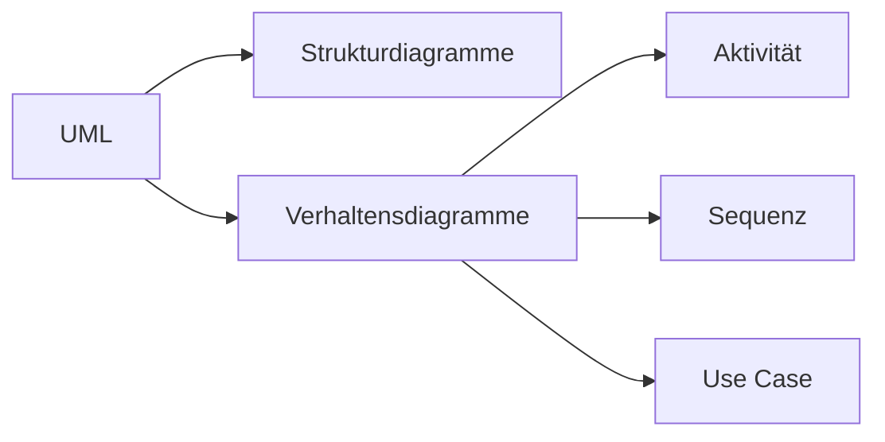

---
# Identity (stable; never change after publishing)
id: ap1-0286
slug: uml-verhaltensdiagramme

# Display
title: "UML-Verhaltensdiagramme und deren Zweck"

# Classification / navigation (machine-side)
module: "Entwickeln, Erstellen und Betreuen von IT_Lösungen"
topics: ["UML", "Modellierung", "Diagramme"]
tags: ["ap1", "uml", "verhaltensdiagramme"]

# Flashcard payload
card:
  type: multi
  question: "Welche UML-Verhaltensdiagramme gibt es und wofür werden sie genutzt?"
  answer: "UML-Verhaltensdiagramme beschreiben, wie sich ein System verhält. Dazu gehören Aktivitätsdiagramm für Abläufe, Zustandsdiagramm für Zustände und Übergänge, Use-Case-Diagramm für Anwendungsfälle, Sequenzdiagramm für zeitliche Interaktionen, Kommunikationsdiagramm für Objektbeziehungen, Interaktionsübersichtsdiagramm für einen Überblick über Interaktionen und Zeitverlaufsdiagramm für Zustandsänderungen über die Zeit."
  examples:
    - "Aktivitätsdiagramm: Ablauf eines Bestellprozesses"
    - "Zustandsdiagramm: Zustände einer Bestellung, z. B. offen, bezahlt, versendet"
    - "Use-Case-Diagramm: Benutzer und Funktionen eines Systems"
    - "Sequenzdiagramm: zeitlicher Ablauf eines Login-Prozesses"
    - "Kommunikationsdiagramm: Zusammenarbeit zwischen Objekten"
    - "Interaktionsübersichtsdiagramm: Überblick über mehrere Interaktionen"
    - "Zeitverlaufsdiagramm: Zustandsänderungen über eine Zeitachse"
    - "Merksatz: Verhaltensdiagramme zeigen, was im System passiert"

# Lifecycle
status: published       # draft | published | deprecated
created: "2026-03-18"
updated: "2026-05-11"
---

## UML-Verhaltensdiagramme und deren Zweck
**UML-Verhaltensdiagramme** beschreiben das **dynamische Verhalten** eines Systems, also Abläufe, Zustände und Interaktionen.

## Kernerklärung

### Wichtige UML-Verhaltensdiagramme

| Diagramm                     | Zweck                                               |
|-----------------------------|-----------------------------------------------------|
| Aktivitätsdiagramm          | Ablauf von Aktivitäten und Prozessen darstellen     |
| Zustandsdiagramm            | Zustände und Zustandsübergänge eines Objekts        |
| Use-Case-Diagramm           | Anwendungsfälle und Akteure                         |
| Sequenzdiagramm             | Zeitliche Abfolge von Interaktionen                 |
| Kommunikationsdiagramm      | Interaktionen mit Fokus auf Beziehungen             |
| Interaktionsübersichtsdiagramm | Kombination/Übersicht von Abläufen             |
| Zeitverlaufsdiagramm        | Zustandsänderungen über die Zeit                    |

### Einordnung

## Praktisches Beispiel

- **Login-Prozess**
  - Aktivitätsdiagramm: zeigt Ablauf  
  - Sequenzdiagramm: zeigt Kommunikation zwischen Client und Server  

## Prüfungsrelevanz (AP1)

### Typische Prüfungsfragen
- Nenne UML-Verhaltensdiagramme  
- Unterschied Sequenz vs. Kommunikationsdiagramm?  
- Wofür nutzt man Aktivitätsdiagramme?  

### Antworten auf die typischen Prüfungsfragen
- Aktivität, Zustand, Use Case, Sequenz etc.  
- Sequenz = zeitlich, Kommunikation = Beziehungen  
- Prozess- und Ablaufdarstellung  

## Merksatz
Verhaltensdiagramme zeigen, was ein System tut – nicht wie es aufgebaut ist.