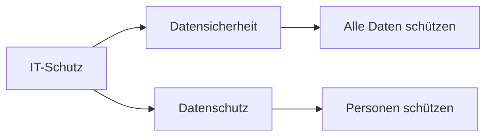

---
# Identity (stable; never change after publishing)
id: ap1-0302
slug: "unterschied-datensicherheit-datenschutz"

# Display
title: "Unterschied zwischen Datensicherheit und Datenschutz"

# Classification / navigation (machine-side)
module: "IT-Sicherheit und Datenschutz, Ergonomie"
topics: ["datensicherheit", "datenschutz", "grundlagen"]
tags: ["ap1", "sicherheit", "recht", "cia"]

# Flashcard payload
card:
  type: comparison
  question: "Was ist der Unterschied zwischen Datensicherheit und Datenschutz?"
  answer: "Datensicherheit schützt Daten allgemein vor Verlust, Manipulation und unbefugtem Zugriff. Datenschutz schützt speziell personenbezogene Daten und die Rechte der betroffenen Personen."
  examples:
    - "Datensicherheit: Backup gegen Datenverlust"
    - "Datensicherheit: Passwortschutz und Rechteverwaltung"
    - "Datensicherheit: Schutz von Kundendaten, Projektdaten oder Systemdaten"
    - "Datenschutz: Schutz personenbezogener Daten wie Name, Adresse oder Geburtsdatum"
    - "Datenschutz: Einhaltung der DSGVO"
    - "Datenschutz: Betroffene Personen haben Rechte, z. B. Auskunft oder Löschung"
    - "Merksatz: Datensicherheit schützt Daten, Datenschutz schützt Menschen hinter den Daten"

# Lifecycle
status: published       # draft | published | deprecated
created: "2026-03-25"
updated: "2026-05-11"
---

## Unterschied zwischen Datensicherheit und Datenschutz
Datensicherheit und Datenschutz werden oft verwechselt, verfolgen aber unterschiedliche Ziele.

- **Datensicherheit** → Schutz aller Daten  
- **Datenschutz** → Schutz personenbezogener Daten und der Menschen dahinter  

## Kernerklärung

### Datensicherheit
- Ziel: Schutz von Daten vor Verlust, Manipulation und unbefugtem Zugriff
- Gilt für **alle Daten**
- Fokus auf technische und organisatorische Maßnahmen
- Schutzziele:
  - Vertraulichkeit  
  - Integrität  
  - Verfügbarkeit  
  - (zusätzlich: Authentizität)

### Datenschutz
- Ziel: Schutz von **personenbezogenen Daten**
- Fokus auf:
  - Rechte der betroffenen Personen
  - Informationspflichten
  - gesetzliche Vorgaben (z. B. DSGVO)

### Vergleich

| Aspekt            | Datensicherheit                          | Datenschutz                              |
|-------------------|------------------------------------------|------------------------------------------|
| Fokus             | Alle Daten                               | Personenbezogene Daten                   |
| Ziel              | Schutz vor Verlust/Manipulation          | Schutz der Privatsphäre                  |
| Maßnahmen         | Technisch + organisatorisch              | Rechtlich + organisatorisch              |
| Beispiel          | Firewall, Backup                         | Einwilligung, Auskunftsrecht             |

## Praktisches Beispiel
- **Datensicherheit:** Backup eines Servers verhindert Datenverlust  
- **Datenschutz:** Kundendaten dürfen nur mit Einwilligung verarbeitet werden  

## Prüfungsrelevanz (AP1)

### Typische Prüfungsfragen
- Was ist der Unterschied zwischen Datensicherheit und Datenschutz?
- Welche Daten betrifft der Datenschutz?
- Nenne die Schutzziele der Datensicherheit.

### Antworten auf die typischen Prüfungsfragen
- Datensicherheit schützt alle Daten technisch, Datenschutz schützt personenbezogene Daten rechtlich.  
- Nur personenbezogene Daten.  
- Vertraulichkeit, Integrität, Verfügbarkeit.

## Merksatz
**Datensicherheit schützt Daten – Datenschutz schützt Menschen.**