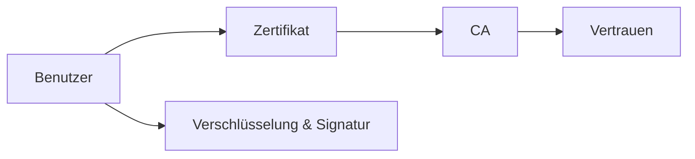

---
# Identity (stable; never change after publishing)
id: ap1-0308
slug: "public-key-infrastruktur-pki"

# Display
title: "Public Key Infrastruktur (PKI)"

# Classification / navigation (machine-side)
module: "IT-Sicherheit und Datenschutz, Ergonomie"
topics: ["kryptografie", "pki", "zertifikate"]
tags: ["ap1", "grundlagen", "verschluesselung", "authentifizierung"]

# Flashcard payload
card:
  type: definition
  question: "Was ist eine PKI?"
  answer: "Eine PKI, Public Key Infrastructure, ist ein System zur Verwaltung digitaler Zertifikate und Schlüssel. Sie nutzt asymmetrische Kryptografie mit öffentlichem und privatem Schlüssel, um Identitäten zu prüfen, Daten zu verschlüsseln und digitale Signaturen zu ermöglichen."
  examples:
    - "HTTPS: Zertifikat bestätigt die Identität einer Webseite"
    - "E-Mail: Nachrichten können verschlüsselt oder digital signiert werden"
    - "VPN: Zertifikate können zur sicheren Anmeldung genutzt werden"
    - "CA: Certificate Authority stellt digitale Zertifikate aus"
    - "Öffentlicher Schlüssel: darf weitergegeben werden"
    - "Privater Schlüssel: muss geheim bleiben"
    - "Merksatz: PKI = Vertrauenssystem für Zertifikate und Schlüssel"

# Lifecycle
status: published       # draft | published | deprecated
created: "2026-03-25"
updated: "2026-05-11"
---

## Public Key Infrastruktur (PKI)
Die Public Key Infrastruktur (PKI) ist ein zentraler Bestandteil moderner IT-Sicherheit.

Sie ermöglicht die sichere Kommunikation durch Verschlüsselung und digitale Signaturen.

## Kernerklärung

### Was ist eine PKI?
- Kryptografisches System innerhalb einer Infrastruktur  
- Nutzt **asymmetrische Verschlüsselung** (Public/Private Key)  
- Dient zur:
  - Verschlüsselung von Daten  
  - digitalen Signatur  
  - Authentifizierung von Teilnehmern  

### Wichtige Bestandteile einer PKI
- **Zertifizierungsstellen (CA)**  
- **Registrierungsstellen (RA)**  
- **Digitale Zertifikate**  
- **Zertifikatssperrlisten (CRL)**  
- **Verzeichnisdienste**  
- **Validierungsdienste**

## Praktisches Beispiel
HTTPS-Verbindung:

- Browser prüft das Zertifikat einer Website  
- Zertifikat wurde von einer vertrauenswürdigen CA ausgestellt  
- Verbindung wird verschlüsselt aufgebaut  

Sichere Datenübertragung im Internet

## Prüfungsrelevanz (AP1)

### Typische Prüfungsfragen
- Was ist eine PKI?
- Welche Bestandteile hat eine PKI?
- Wozu dient sie?

### Antworten auf die typischen Prüfungsfragen
- System für Zertifikate und Verschlüsselung.  
- CA, RA, Zertifikate, CRL etc.  
- Sicherer Datenaustausch und Authentifizierung.

## Merksatz
**PKI sorgt für Vertrauen durch Zertifikate und sichere Verschlüsselung.**