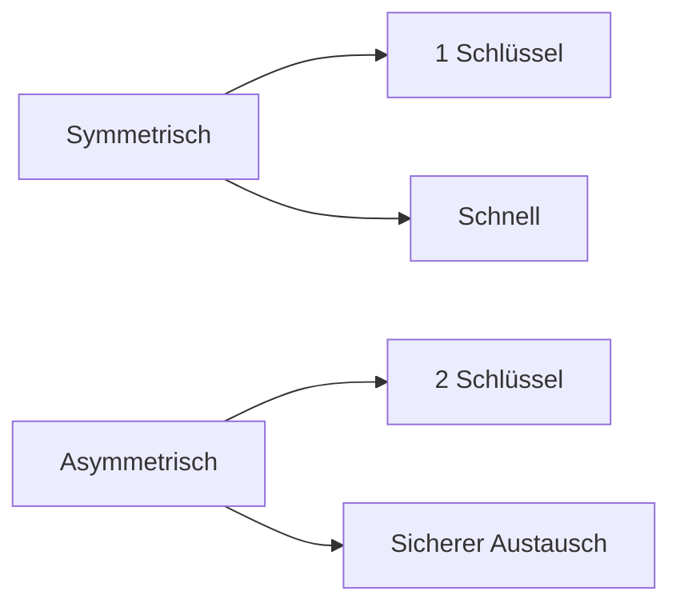

---
# Identity (stable; never change after publishing)
id: ap1-0314
slug: "symmetrisch-vs-asymmetrisch"

# Display
title: "Symmetrische vs. asymmetrische Verschlüsselung"

# Classification / navigation (machine-side)
module: "IT-Sicherheit und Datenschutz, Ergonomie"
topics: ["kryptografie", "verschluesselung", "vergleich"]
tags: ["ap1", "grundlagen", "sicherheit", "rsa", "aes"]

# Flashcard payload
card:
  type: comparison
  question: "Wie unterscheiden sich symmetrische und asymmetrische Verschlüsselung?"
  answer: "Symmetrische Verschlüsselung nutzt einen gemeinsamen geheimen Schlüssel für Verschlüsselung und Entschlüsselung. Sie ist schnell, aber der sichere Schlüsselaustausch ist schwierig. Asymmetrische Verschlüsselung nutzt ein Schlüsselpaar aus öffentlichem und privatem Schlüssel. Sie ist langsamer, erleichtert aber Schlüsselaustausch und digitale Signaturen."
  examples:
    - "Symmetrisch: ein gemeinsamer geheimer Schlüssel"
    - "Symmetrisch: schnell, gut für große Datenmengen"
    - "Symmetrisch: Beispiele sind AES, Triple-DES und Blowfish"
    - "Symmetrisch: Einsatz bei Datenverschlüsselung, VPN oder WLAN"
    - "Asymmetrisch: öffentlicher Schlüssel und privater Schlüssel"
    - "Asymmetrisch: langsamer, aber gut für Schlüsselaustausch"
    - "Asymmetrisch: Beispiele sind RSA und ECC"
    - "Asymmetrisch: Einsatz bei digitalen Signaturen, Zertifikaten und HTTPS"
    - "Praxis: Oft werden beide kombiniert, z. B. bei TLS/HTTPS"
    - "Merksatz: symmetrisch = gleicher Schlüssel, asymmetrisch = Schlüsselpaar"

# Lifecycle
status: published       # draft | published | deprecated
created: "2026-03-25"
updated: "2026-05-12"
---

## Symmetrische vs. asymmetrische Verschlüsselung

Symmetrische und asymmetrische Verschlüsselung unterscheiden sich grundlegend in Aufbau und Einsatz.

Beide werden oft **kombiniert** verwendet (z. B. TLS).

## Kernerklärung

### Vergleich

| Kriterium              | Symmetrisch                     | Asymmetrisch                         |
|-----------------------|--------------------------------|--------------------------------------|
| Schlüsselanzahl       | 1 Schlüssel                    | 2 Schlüssel (öffentlich/privat)       |
| Geschwindigkeit       | schnell & effizient            | langsam & rechenintensiv             |
| Schlüsselaustausch    | problematisch                  | einfach (öffentlicher Schlüssel)     |
| Algorithmen           | AES, DES, 3DES                 | RSA, ECC, DSA                        |
| Anwendungsfälle       | große Datenmengen, VPN         | Signaturen, Schlüsselaustausch       |

### Typische Algorithmen
- **Symmetrisch:** AES, DES, 3DES  
- **Asymmetrisch:** RSA, ECC, DSA  

## Praktisches Beispiel
- **HTTPS (TLS):**
  - Asymmetrisch → Schlüsselaustausch  
  - Symmetrisch → Datenübertragung  

Kombination der Vorteile beider Verfahren

## Prüfungsrelevanz (AP1)

### Typische Prüfungsfragen
- Unterschied symmetrisch vs. asymmetrisch?  
- Wann wird welches Verfahren eingesetzt?  

### Antworten auf die typischen Prüfungsfragen
- Symmetrisch = schnell, aber Schlüsselproblem  
- Asymmetrisch = sicherer Austausch, aber langsam  
- Kombination in der Praxis üblich  

## Merksatz
**Symmetrisch = schnell, asymmetrisch = sicherer Schlüsselaustausch.**