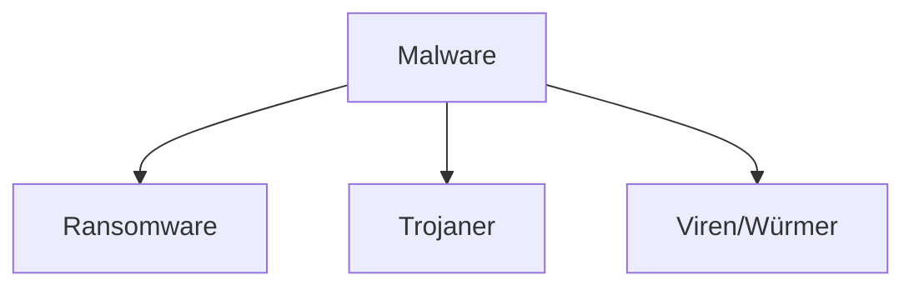

---
# Identity (stable; never change after publishing)
id: ap1-0317
slug: "malware-ransomware-trojaner"

# Display
title: "Malware, Ransomware und Trojaner"

# Classification / navigation (machine-side)
module: "IT-Sicherheit und Datenschutz, Ergonomie"
topics: ["malware", "bedrohungen", "sicherheit"]
tags: ["ap1", "grundlagen", "angriffe"]

# Flashcard payload
card:
  type: comparison
  question: "Wie unterscheiden sich Malware, Ransomware und Trojaner?"
  answer: "Malware ist der Oberbegriff für schädliche Software. Ransomware ist eine Malware-Art, die Daten verschlüsselt oder Systeme sperrt und Lösegeld fordert. Ein Trojaner tarnt sich als nützliches oder harmloses Programm, führt aber im Hintergrund schädliche Aktionen aus."
  examples:
    - "Malware: Oberbegriff für Viren, Würmer, Trojaner, Spyware und Ransomware"
    - "Ransomware: Dateien werden verschlüsselt und Lösegeld wird gefordert"
    - "Trojaner: scheinbar nützliches Programm enthält versteckte Schadfunktion"
    - "Beispiel Ransomware: Zugriff auf Firmendaten wird gesperrt"
    - "Beispiel Trojaner: gefälschter Download installiert Schadsoftware"
    - "Merksatz: Malware = Schadsoftware, Ransomware = Erpressung, Trojaner = Tarnung"

# Lifecycle
status: published       # draft | published | deprecated
created: "2026-03-27"
updated: "2026-05-12"
---

## Malware, Ransomware und Trojaner
Die Begriffe beschreiben unterschiedliche Arten von Schadsoftware mit verschiedenen Zielen und Funktionsweisen.

- **Malware** = Oberbegriff  
- **Ransomware** = Erpressung  
- **Trojaner** = Tarnung  

## Kernerklärung

### Definitionen

| Begriff     | Beschreibung |
|------------|-------------|
| Malware    | Oberbegriff für Schadsoftware (z. B. Viren, Würmer, Trojaner, Ransomware) |
| Ransomware | Verschlüsselt Daten und fordert Lösegeld zur Entschlüsselung |
| Trojaner   | Tarnt sich als legitimes Programm und installiert heimlich Schadsoftware |

### Einordnung

### Wichtige Eigenschaften

- **Malware:** Sammelbegriff für alle schädlichen Programme  
- **Ransomware:** Fokus auf **Erpressung (z. B. Bitcoin-Zahlung)**  
- **Trojaner:** Fokus auf **Täuschung und Einschleusen**  

## Praktisches Beispiel
- Ein Nutzer lädt ein scheinbar nützliches Tool herunter → **Trojaner**  
- Im Hintergrund wird Schadsoftware installiert → **Malware**  
- Dateien werden verschlüsselt und Lösegeld gefordert → **Ransomware**  

## Prüfungsrelevanz (AP1)

### Typische Prüfungsfragen
- Was ist Malware?  
- Was macht Ransomware?  
- Wie funktioniert ein Trojaner?  

### Antworten auf die typischen Prüfungsfragen
- Malware = Oberbegriff für Schadsoftware  
- Ransomware = verschlüsselt Daten und fordert Lösegeld  
- Trojaner = tarnt sich als legitime Software  

## Merksatz
**Malware = Oberbegriff, Ransomware = Erpressung, Trojaner = Tarnung.**