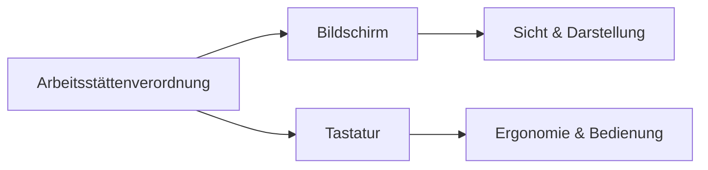

---
# Identity (stable; never change after publishing)
id: ap1-0324
slug: "arbeitsstaettenverordnung-bildschirm-tastatur"

# Display
title: "Arbeitsstättenverordnung: Bildschirm & Tastatur"

# Classification / navigation (machine-side)
module: "IT-Sicherheit und Datenschutz, Ergonomie"
topics: ["ergonomie", "arbeitsplatz", "arbstaettv"]
tags: ["ap1", "richtlinien", "gesundheit"]

# Flashcard payload
card:
  type: multi
  question: "Was regelt die ArbStättV für Bildschirm und Tastatur am Arbeitsplatz?"
  answer: "Die Arbeitsstättenverordnung fordert, dass Bildschirmarbeitsplätze sicher und ergonomisch gestaltet sind. Der Bildschirm soll gut lesbar, flimmerfrei, einstellbar und möglichst frei von Blendung oder Reflexionen sein. Die Tastatur soll vom Bildschirm getrennt, gut bedienbar, reflexionsarm und ergonomisch aufstellbar sein."
  examples:
    - "Bildschirm: gut lesbare und scharfe Darstellung"
    - "Bildschirm: Helligkeit und Kontrast einstellbar"
    - "Bildschirm: möglichst keine Blendung oder störende Reflexion"
    - "Bildschirm: passend aufstellbar und ausrichtbar"
    - "Tastatur: getrennt vom Bildschirm"
    - "Tastatur: reflexionsarm und gut lesbar beschriftet"
    - "Tastatur: so aufstellen, dass eine neutrale Körperhaltung möglich ist"
    - "Merksatz: Bildschirmarbeit = gut lesbar, blendfrei, verstellbar und ergonomisch bedienbar"

# Lifecycle
status: published       # draft | published | deprecated
created: "2026-03-28"
updated: "2026-05-12"
---

## Arbeitsstättenverordnung: Bildschirm & Tastatur
Die Arbeitsstättenverordnung (ArbStättV) regelt die ergonomische Gestaltung von Bildschirmarbeitsplätzen.

Sie enthält konkrete Anforderungen an **Bildschirmgeräte und Tastaturen**, um gesundes Arbeiten zu gewährleisten.

## Kernerklärung

### Anforderungen an den Bildschirm

- Zeichen müssen:
  - **scharf, deutlich und ausreichend groß** sein  
- Darstellung:
  - **stabil, flimmerfrei und unverzerrt**  
- **Helligkeit und Kontrast einstellbar**  
- Arbeitsplatz:
  - frei von **Reflexionen und Blendungen**  
- Bildschirm:
  - **frei beweglich, dreh- und neigbar**  
  - unabhängig vom Arbeitsplatz positionierbar  

### Anforderungen an die Tastatur

- **Getrennt vom Bildschirm** (flexible Positionierung)  
- **Neigbar** für ergonomische Haltung  
- **Auflagefläche für Hände** vorhanden  
- **Reflexionsarme Oberfläche**  
- Beschriftung:
  - gut lesbar  
  - deutlich vom Hintergrund abgehoben  

### Übersicht

| Komponente | Anforderungen |
|------------|-------------|
| Bildschirm | scharf, flimmerfrei, einstellbar, blendfrei |
| Tastatur   | getrennt, neigbar, ergonomisch, gut lesbar |

## Praktisches Beispiel

Ein Arbeitsplatz wird nach ArbStättV eingerichtet:

- Monitor ohne Spiegelungen und höhenverstellbar  
- Tastatur separat und leicht geneigt  
- Zeichen gut lesbar und kontrastreich  

Ergebnis: weniger Augenbelastung und ergonomisches Arbeiten.

## Prüfungsrelevanz (AP1)

### Typische Prüfungsfragen
- Welche Anforderungen stellt die ArbStättV an Bildschirmgeräte?  
- Welche Eigenschaften muss eine Tastatur erfüllen?  

### Antworten auf die typischen Prüfungsfragen
- Bildschirm: flimmerfrei, einstellbar, keine Blendung  
- Tastatur: getrennt, neigbar, ergonomisch, gut lesbar  

## Merksatz
**Guter Bildschirm = gutes Sehen, gute Tastatur = entspanntes Arbeiten.**