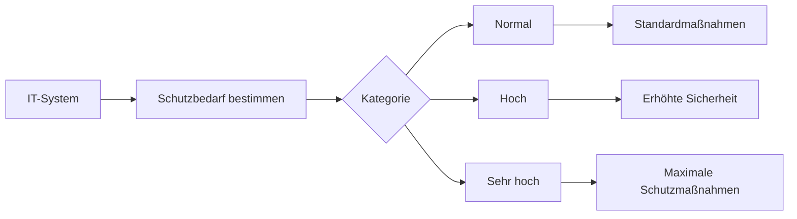

---
# Identity (stable; never change after publishing)
id: ap1-0330
slug: "schutzbedarfskategorien-bsi"

# Display
title: "Schutzbedarfskategorien nach BSI (normal, hoch, sehr hoch)"

# Classification / navigation (machine-side)
module: "IT-Sicherheit und Datenschutz, Ergonomie"
topics: ["schutzbedarf", "bsi", "klassifizierung"]
tags: ["ap1", "it-sicherheit", "grundschutz"]

# Flashcard payload
card:
  type: comparison
  question: "Wie unterscheiden sich die Schutzbedarfskategorien normal, hoch und sehr hoch?"
  answer: "Beim BSI IT-Grundschutz wird Schutzbedarf nach möglichen Schadensauswirkungen bewertet. Normal bedeutet: Die Auswirkungen sind begrenzt und überschaubar. Hoch bedeutet: Die Auswirkungen können beträchtlich sein. Sehr hoch bedeutet: Die Auswirkungen können existenziell bedrohlich oder katastrophal sein. Geldgrenzen können intern als Orientierung festgelegt werden, sind aber nicht die einzige Grundlage."
  examples:
    - "Normal: kurzer Ausfall eines unkritischen Arbeitsplatz-PCs"
    - "Normal: begrenzter Schaden, der beherrschbar bleibt"
    - "Hoch: längerer Ausfall eines wichtigen Fachverfahrens"
    - "Hoch: erheblicher finanzieller Schaden oder starker Arbeitsausfall"
    - "Sehr hoch: Ausfall eines geschäftskritischen Systems"
    - "Sehr hoch: existenzbedrohender Schaden oder sehr schwerer Vertrauensverlust"
    - "Schutzziele: Vertraulichkeit, Integrität und Verfügbarkeit bewerten"
    - "Merksatz: normal = überschaubar, hoch = beträchtlich, sehr hoch = existenzbedrohend"

# Lifecycle
status: published       # draft | published | deprecated
created: "2026-03-28"
updated: "2026-05-12"
---

## Schutzbedarfskategorien nach BSI

Die Schutzbedarfskategorien nach BSI dienen dazu, den **Schutzbedarf von IT-Systemen** einzuordnen und passende Sicherheitsmaßnahmen abzuleiten.

## Kernerklärung

### Schutzbedarfskategorien

| Kategorie | Beschreibung |
|----------|-------------|
| **Normal** | - Geringe rechtliche Konsequenzen - Kaum Auswirkungen auf Betroffene/Ansehen - Finanzieller Schaden < 50.000 € |
| **Hoch** | - Schwere rechtliche Konsequenzen - Deutliche Auswirkungen auf Betroffene/Ansehen - Finanzieller Schaden 50.000–500.000 € |
| **Sehr hoch** | - Existenzbedrohende Konsequenzen - Massive Auswirkungen auf Betroffene/Ansehen - Finanzieller Schaden > 500.000 € |

### Zusammenhang

## Praktisches Beispiel

- **Normal**: Interne Terminplanung  
- **Hoch**: Kundendatenbank eines Unternehmens  
- **Sehr hoch**: Bankensystem oder kritische Infrastruktur  

Je höher der Schutzbedarf, desto stärker müssen Sicherheitsmaßnahmen sein.

## Prüfungsrelevanz (AP1)

### Typische Prüfungsfragen
- Welche Schutzbedarfskategorien gibt es nach BSI?  
- Worin unterscheiden sich die Kategorien?  

### Antworten auf die typischen Prüfungsfragen
- Normal, hoch, sehr hoch  
- Unterschied liegt in Schadenshöhe, Auswirkungen und Konsequenzen  

## Merksatz
**Je größer der mögliche Schaden, desto höher der Schutzbedarf.**