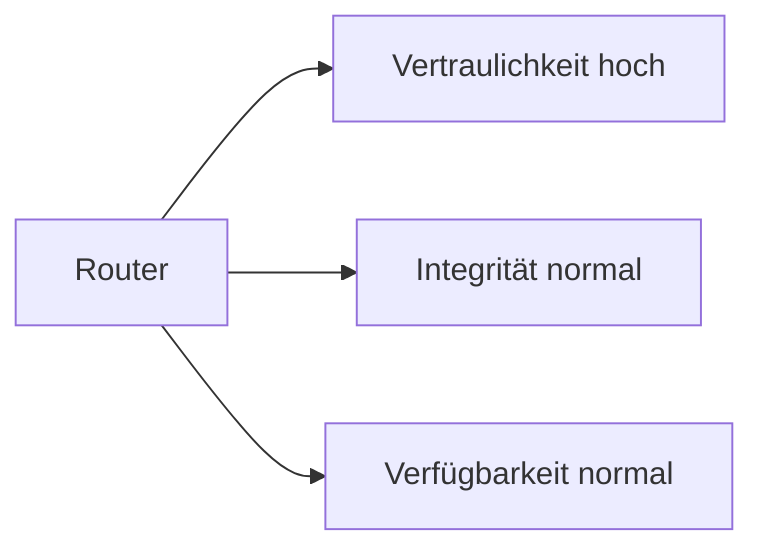

---
# Identity (stable; never change after publishing)
id: ap1-0331
slug: "router-schutzziele-bsi"

# Display
title: "Schutzziele und Schutzbedarf eines Routers (BSI)"

# Classification / navigation (machine-side)
module: "IT-Sicherheit und Datenschutz, Ergonomie"
topics: ["schutzziele", "bsi", "router"]
tags: ["ap1", "it-sicherheit", "cia"]

# Flashcard payload
card:
  type: comparison
  question: "Welche Schutzziele müssen bei einem Router bewertet werden?"
  answer: "Bei einem Router werden die Schutzziele Vertraulichkeit, Integrität und Verfügbarkeit bewertet. Der konkrete Schutzbedarf hängt vom Einsatz ab. Beispiel: Vertraulichkeit kann hoch sein, wenn sensible Verbindungs- oder Konfigurationsdaten betroffen sind. Integrität ist wichtig, weil falsche Routing- oder Firewall-Regeln den Datenverkehr manipulieren können. Verfügbarkeit ist wichtig, weil ein Routerausfall Netzwerkverbindungen unterbrechen kann."
  examples:
    - "Vertraulichkeit: Konfigurationsdaten, Zugangsdaten oder VPN-Informationen schützen"
    - "Integrität: Routing-Tabellen und Firewall-Regeln dürfen nicht unbefugt verändert werden"
    - "Verfügbarkeit: Ausfall des Routers kann Internet- oder Standortverbindungen unterbrechen"
    - "Schutzbedarf normal: Ausfall oder Änderung hat nur begrenzte Auswirkungen"
    - "Schutzbedarf hoch: Ausfall oder Manipulation betrifft wichtige Geschäftsprozesse"
    - "Schutzbedarf sehr hoch: Ausfall oder Manipulation gefährdet kritische oder zentrale Dienste"
    - "Merksatz: Router bewerten nach Vertraulichkeit, Integrität und Verfügbarkeit - der Schutzbedarf hängt vom Einsatz ab"

# Lifecycle
status: published       # draft | published | deprecated
created: "2026-03-28"
updated: "2026-05-12"
---

## Schutzziele und Schutzbedarf eines Routers (BSI)

Router sind zentrale Netzwerkkomponenten und müssen entsprechend abgesichert werden.  
Dabei werden die drei klassischen Schutzziele betrachtet.

## Kernerklärung

### Schutzziele (CIA-Prinzip)

| Schutzziel | Schutzbedarf | Begründung |
|-----------|-------------|-----------|
| **Vertraulichkeit** | hoch | Über Router werden auch sensible Daten übertragen → Abhören muss verhindert werden |
| **Integrität** | normal | Fehlerhafte Daten können meist erkannt werden → geringeres Risiko |
| **Verfügbarkeit** | normal | Kurzzeitiger Ausfall ist oft tolerierbar |

### Zusammenhang

## Praktisches Beispiel

Ein Unternehmensrouter:

- Verschlüsselt Daten (VPN) → schützt Vertraulichkeit  
- Prüfsummen sichern Datenintegrität  
- Redundante Systeme erhöhen Verfügbarkeit  

## Prüfungsrelevanz (AP1)

### Typische Prüfungsfragen
- Welche Schutzziele gibt es?  
- Wie ist der Schutzbedarf eines Routers?  

### Antworten auf die typischen Prüfungsfragen
- Vertraulichkeit, Integrität, Verfügbarkeit  
- Router: Vertraulichkeit hoch, Integrität & Verfügbarkeit normal  

## Merksatz
**Beim Router ist Datenschutz wichtiger als ständige Verfügbarkeit.**