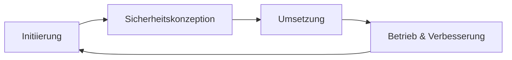

---
# Identity (stable; never change after publishing)
id: ap1-0333
slug: "sicherheitsprozess-bsi-phasen"

# Display
title: "Phasen des Sicherheitsprozesses nach BSI IT-Grundschutz"

# Classification / navigation (machine-side)
module: "IT-Sicherheit und Datenschutz, Ergonomie"
topics: ["bsi", "sicherheitsprozess"]
tags: ["ap1", "it-sicherheit", "grundschutz"]

# Flashcard payload
card:
  type: steps
  question: "Welche Phasen umfasst der Sicherheitsprozess nach BSI IT-Grundschutz?"
  answer: "Der Sicherheitsprozess nach BSI IT-Grundschutz umfasst die Initiierung, die Erstellung einer Sicherheitskonzeption, die Umsetzung der Sicherheitskonzeption sowie die Aufrechterhaltung und kontinuierliche Verbesserung."
  examples:
    - "Initiierung: Sicherheitsprozess starten und Verantwortliche festlegen"
    - "Sicherheitskonzeption: Schutzbedarf, Risiken und Maßnahmen planen"
    - "Umsetzung: geplante Sicherheitsmaßnahmen einführen"
    - "Aufrechterhaltung: Maßnahmen regelmäßig prüfen"
    - "Verbesserung: Sicherheitskonzept bei Änderungen oder neuen Risiken anpassen"
    - "Merksatz: starten, planen, umsetzen, prüfen und verbessern"

# Lifecycle
status:  published       # draft | published | deprecated
created: "2026-03-28"
updated: "2026-05-12"
---

## Phasen des Sicherheitsprozesses nach BSI IT-Grundschutz

Der Sicherheitsprozess nach BSI IT-Grundschutz beschreibt den strukturierten Aufbau und Betrieb eines Informationssicherheitsmanagements (ISMS).

## Kernerklärung

### Phasen des Sicherheitsprozesses

1. **Initiierung**
   - Verantwortung durch Leitungsebene
   - Planung und Organisation der Sicherheit
   - Festlegung von Richtlinien

2. **Erstellung der Sicherheitskonzeption**
   - Analyse der IT-Systeme
   - Definition von Maßnahmen und Schutzbedarf

3. **Umsetzung der Sicherheitskonzeption**
   - Einführung der geplanten Sicherheitsmaßnahmen

4. **Aufrechterhaltung und kontinuierliche Verbesserung**
   - Betrieb der Sicherheitsmaßnahmen
   - Regelmäßige Überprüfung und Optimierung

### Zusammenhang

## Praktisches Beispiel

Ein Unternehmen führt ein ISMS ein:

- Leitung definiert Sicherheitsziele  
- IT erstellt ein Sicherheitskonzept  
- Maßnahmen (Firewall, MFA) werden umgesetzt  
- Regelmäßige Audits verbessern das System  

## Prüfungsrelevanz (AP1)

### Typische Prüfungsfragen
- Nenne die Phasen des BSI-Sicherheitsprozesses  
- Warum ist kontinuierliche Verbesserung wichtig?  

### Antworten auf die typischen Prüfungsfragen
- Initiierung, Konzeption, Umsetzung, Verbesserung  
- Bedrohungen ändern sich ständig → Anpassung notwendig  

## Merksatz
**Sicherheit ist ein Prozess, kein Zustand.**