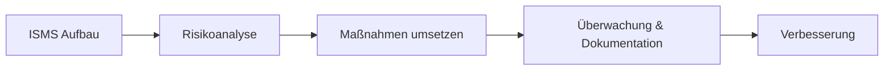

---
# Identity (stable; never change after publishing)
id: ap1-0335
slug: "iso-27001-zertifizierung-inhalte"

# Display
title: "Inhalte einer ISO 27001 Zertifizierung"

# Classification / navigation (machine-side)
module: "IT-Sicherheit und Datenschutz, Ergonomie"
topics: ["iso27001", "isms", "zertifizierung"]
tags: ["ap1", "it-sicherheit", "normen"]

# Flashcard payload
card:
  type: definition
  question: "Was ist ISO/IEC 27001 und was wird dabei zertifiziert?"
  answer: "ISO/IEC 27001 ist ein internationaler Standard für ein Informationssicherheitsmanagementsystem, kurz ISMS. Zertifiziert wird, ob ein Unternehmen Informationssicherheit systematisch organisiert, Risiken bewertet, Schutzmaßnahmen umsetzt, dokumentiert und regelmäßig verbessert."
  examples:
    - "ISMS: Informationssicherheit wird geplant, gesteuert und kontrolliert"
    - "Risikomanagement: Sicherheitsrisiken erkennen und bewerten"
    - "Maßnahmen: z. B. Zugriffsschutz, Backups, Schulungen und Sicherheitsrichtlinien"
    - "Dokumentation: Prozesse, Verantwortlichkeiten und Sicherheitsregeln festhalten"
    - "Kontrolle: Maßnahmen regelmäßig prüfen und verbessern"
    - "Merksatz: ISO/IEC 27001 = Zertifikat für organisiertes Informationssicherheitsmanagement"

# Lifecycle
status: published       # draft | published | deprecated
created: "2026-03-28"
updated: "2026-05-12"
---

## Inhalte einer ISO 27001 Zertifizierung

Die ISO 27001 ist ein internationaler Standard für Informationssicherheits-Managementsysteme (ISMS) und definiert Anforderungen für deren Aufbau und Betrieb.

## Kernerklärung

### Zentrale Inhalte der ISO 27001

- **Aufbau eines ISMS**
- **Einführung und Umsetzung von Sicherheitsmaßnahmen**
- **Betriebliche Überwachung und Dokumentation**
- **Risikomanagement (Identifikation, Analyse, Behandlung)**
- **Umgang mit Bedrohungen** (z. B. Hackerangriffe, Ausfälle)

### Erweiterter Betrachtungsbereich

ISO 27001 betrachtet nicht nur IT-Systeme, sondern auch:

- **Organisation**
- **Personal**
- **Gebäude / Infrastruktur**
- **Geschäftsprozesse**

### Ziel

- Schutz vor Störungen, Angriffen und Ausfällen  
- Sicherstellung der Informationssicherheit im gesamten Unternehmen  

## Praktisches Beispiel

Ein Unternehmen führt ISO 27001 ein:

- Risiken (z. B. Cyberangriffe) werden analysiert  
- Sicherheitsmaßnahmen (Firewall, MFA) eingeführt  
- Prozesse dokumentiert und regelmäßig überprüft  

## Prüfungsrelevanz (AP1)

### Typische Prüfungsfragen
- Was umfasst eine ISO 27001 Zertifizierung?  
- Welche Bereiche werden neben IT berücksichtigt?  

### Antworten auf die typischen Prüfungsfragen
- ISMS, Risikomanagement, Umsetzung und Kontrolle von Maßnahmen  
- Organisation, Personal, Infrastruktur und Prozesse  

## Merksatz
**ISO 27001 = ganzheitliche Informationssicherheit im Unternehmen.**