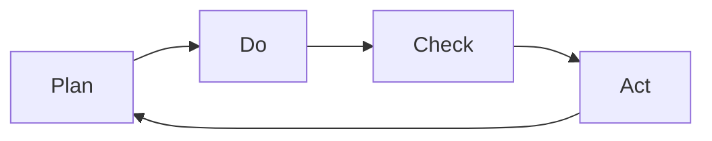

---
# Identity (stable; never change after publishing)
id: ap1-0336
slug: "vorteile-iso-27001-zertifizierung"

# Display
title: "Vorteile einer ISO 27001 Zertifizierung"

# Classification / navigation (machine-side)
module: "IT-Sicherheit und Datenschutz, Ergonomie"
topics: ["iso27001", "isms", "vorteile"]
tags: ["ap1", "it-sicherheit", "normen"]

# Flashcard payload
card:
  type: multi
  question: "Welche Vorteile bringt eine ISO/IEC 27001 Zertifizierung?"
  answer: "Eine ISO/IEC 27001 Zertifizierung verbessert den Schutz von Informationen, Prozessen und IT-Systemen. Sie stärkt das Vertrauen von Kunden und Partnern, unterstützt Compliance, senkt Risiken durch Sicherheitsvorfälle und fördert die kontinuierliche Verbesserung der Informationssicherheit."
  examples:
    - "Schutz: Informationen und Geschäftsprozesse werden besser abgesichert"
    - "Vertrauen: Kunden und Partner sehen, dass Sicherheit ernst genommen wird"
    - "Compliance: gesetzliche oder vertragliche Anforderungen können besser erfüllt werden"
    - "Risiken: Sicherheitsvorfälle werden systematischer verhindert oder reduziert"
    - "Kosten: weniger Schäden durch Ausfälle, Datenverlust oder Angriffe"
    - "PDCA: Sicherheitsmaßnahmen werden geplant, geprüft und verbessert"
    - "Bewusstsein: Mitarbeitende werden stärker für Informationssicherheit sensibilisiert"
    - "Merksatz: ISO/IEC 27001 = mehr Sicherheit, mehr Vertrauen, weniger Risiko"

# Lifecycle
status: published       # draft | published | deprecated
created: "2026-03-28"
updated: "2026-05-12"
---

## Vorteile einer ISO 27001 Zertifizierung

Eine ISO 27001 Zertifizierung bringt Unternehmen strukturierte Informationssicherheit und messbare Vorteile im Betrieb und Wettbewerb.

## Kernerklärung

### Zentrale Vorteile

- **Schutz von Informationen und Geschäftsprozessen**
- **Vertrauensgewinn** bei Kunden, Partnern und Investoren  
- **Kontinuierliche Verbesserung** (PDCA-Zyklus)  
- **Kostenreduktion** durch weniger Sicherheitsvorfälle  
- **Risikominimierung & Optimierung** im Umgang mit Daten  
- **Steigerung des Sicherheitsbewusstseins** der Mitarbeitenden  

### PDCA-Zyklus (Grundprinzip)

## Praktisches Beispiel

Ein Unternehmen mit ISO 27001:

- erkennt Sicherheitslücken frühzeitig  
- reduziert Ausfälle durch präventive Maßnahmen  
- gewinnt Vertrauen bei Kunden durch Zertifizierung  

## Prüfungsrelevanz (AP1)

### Typische Prüfungsfragen
- Nenne Vorteile einer ISO 27001 Zertifizierung  
- Warum ist der PDCA-Zyklus wichtig?  

### Antworten auf die typischen Prüfungsfragen
- Sicherheit, Vertrauen, Kostenersparnis, Verbesserung  
- Er sorgt für kontinuierliche Optimierung der Sicherheit  

## Merksatz
**ISO 27001 schafft Sicherheit, Vertrauen und kontinuierliche Verbesserung.**